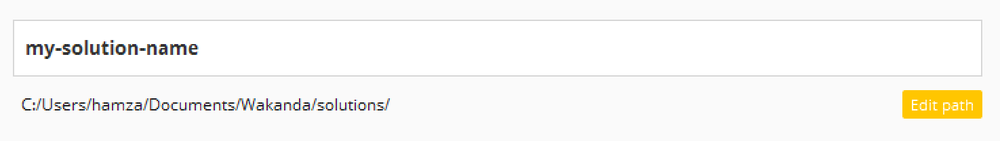

---
---

# Choose your templates

## Table of contents

- [Set a name for your solution](#set-a-name-for-your-solution)
- [Choose your mobile template](#choose-your-mobile-template)
- [Choose your web template](#choose-your-web-template)

## 1 - Set a name for your solution

Enter a name for your solution:

> **TIPS**: 
> - click on  to change where your solution will be created

## 2 - Choose your mobile template

Select a template from the list of the mobile templates:

## 3 - Choose your web template

Select a template from the list of the web templates:

-----

if you’d like to add another application template, please contact us through the [Wakanda issues section](https://github.com/Wakanda/wakanda-issues)
