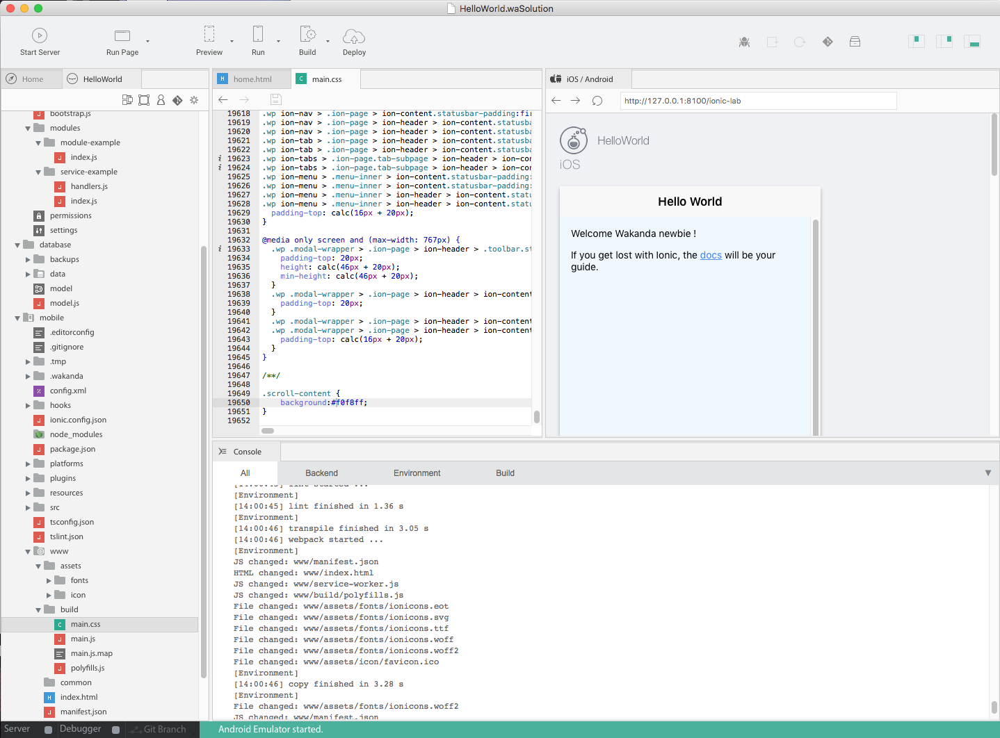

---
---

# Hello World: your first Mobile Web App

## Table of contents

- [Install Wakanda](#install-wakanda)
- [Choose : mobile or web app ?](#choose-mobile-or-web-app)
- [Check for dependencies](#check-for-dependencies)
- [Code and preview](#code-preview)
- [Run on emulator](#run-on-emulator)
- [Run on device](#run-on-device)
- [Server-Side](#Server-Side)

## Install Wakanda

First, download and install **Wakanda Community Edition**

- On Windows, [x86](https://github.com/Wakanda/wakanda-digital-app-factory/releases/download/v1.1.3/wakanda-community-all_1.1.3_x86.msi "download") or [x64](https://github.com/Wakanda/wakanda-digital-app-factory/releases/download/v1.1.3/wakanda-community-all_1.1.3_x64.msi "download")
- On Mac OS X, [x64](https://github.com/Wakanda/wakanda-digital-app-factory/releases/download/v1.1.3/wakanda-community-all_1.1.3_x64.dmg "download")

Now we can start our **HelloWorld** project.  

## Choose : mobile or web app ?
We can choose the kind of app we want to create : mobile, web or both.

Let’s say we want to create an Android app with Ionic2.

To do that, we're going to use the studio, and click on "Create a new solution":

Which opens the template selection page:  

There, you can name your app (without spaces) and select the ionic2 blank template.

Now, in your **HelloWorld** project, you can find the basic ionic2 file structure :

  

You have 3 folders at the root of your project:

- Database , in which you’ll find your data model(s) and data  
- Mobile, where you’ll find all your front end files  
- Backend, where you’ll find the settings and permissions on your app and your business logic  

For our “Hello world” we’re going to work first in the mobile folder.

## Check for dependencies

For mobile apps, you need to check for any missing dependencies.
Go in the main menu  (_Help_ > _Wakanda Troubleshooting_) and choose Android.

Here you can see I miss Homebrew, Apache And and Android SDK. All is explained there: why I need them, and how to install them.

## Code and preview  

Once all your dependencies are checked you can preview your app.

Just click on your project, and then on "Preview".

Let's have a look to our project structure : the src folder is the classical [ionic2 project structure](http://ionicframework.com/docs/v2/setup/tutorial/project-structure/ "ionic tutorial").

A simple change in `pages/hello-ionic.html` and I have my **HelloWorld** done.

You can change the background color in `mobile/www/build/main.css` to make it more visual.
The preview is automatically reloaded after each saving.

You can select "Preview in web browser" if you prefer to see the result in your default browser.  

## Run on emulator  

Now you can run your app on the Android emulator.

## Run on device  

Make sure you have [USB debugging enabled](http://developer.android.com/tools/device.html).

Wakanda Studio automatically detects supported device connected to the USB port.
Open the _Run_ dropdown and select the device to run on:

## Server-Side

### Design your data model

1 - Create your model

`database/model.waModel`

> **TIPS**:
> - click on  to change the view options (the `.waModel` extension is hidden by default)
> - click on  to quickly access your model

2 - Add your Data Class

  

3 - Check-it in the Browser

4 - Update your Front-Side

[Getting Started »](index.html){:class="btn"}
